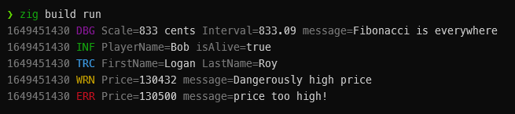

# zlog - Zero-Allocation Logging
A [zerolog](https://github.com/rs/zerolog)-inspired log library for Zig.



## Features
 - Blazing fast
 - Zero allocations
 - Leveled logging
 - Contextual logging 
 - JSON, Plain, and Pretty logging formats

## Getting Started

Copy `zlog` folder to a `libs` subdirectory of the root of your project.
Then in your `build.zig` add:
```zig
const std = @import("std");
const zmath = @import("libs/zlog/build.zig");

pub fn build(b: *std.build.Builder) void {
    ...
    exe.addPackage(zlog.pkg);
}
```
Now you can import and use `zlog`!

### Simple Logging Example
For simple logging, import a global logger
```zig
const zlog = @import("zlog");
const log = &zlog.json_logger;
// You could also use pretty_logger, plain_logger 

pub fn main() anyerror!void {
    try log.print("Hello!");
}
// Output: {"time":1516134303,"level":"debug","message":"hello world"}
```
> **Note:** By default, log writes to StdErr at the log level of `.debug`
> 
> The default log level **global filter** depends on the build mode:
> - .Debug => .debug
> - .ReleaseSafe => .info
> - .ReleaseFast, .ReleaseSmall => .warn

### Contextual Logging
Loggers create events, which do the log writing.
You can add strongly-typed key:value pairs to an event context.
Then the `msg`, `msgf`, or `send` method will write the event to the log.
**Note:** Without calling any of those 3 methods, the log will not be written.

```zig
const zlog = @import("zlog");
const log = &zlog.json_logger;

pub fn main() anyerror!void {
    var ev = try log.event(.debug);
    try ev.str("Scale", "833 cents");
    try ev.num("Interval", 833.09);
    try ev.msg("Fibonacci is everywhere");

    var ev2 = try log.event(.debug);
    try ev2.str("Name", "Tom");
    try ev2.send();
}
// Output: {"time":1649450646,"level":"debug","Scale":"833 cents","Interval":833.09,"message":"Fibonacci is everywhere"}
// Output: {"time":1649450646,"level":"debug","Name":"Tom"}
```

You can add context to a logger so that every event it creates also has that context.
You can also create subloggers that use the parent logger's context along with their own context.

```zig
const zlog = @import("zlog");
const log = &zlog.json_logger;

pub fn main() anyerror!void {
    try log.strCtx("component", "foo");

    var ev = try log.event(.info);
    try ev.msg("hello world");

    // create sublogger, bringing along log's context 
    var sublog = try log.sublogger(.info);
    try sublog.numCtx("num", 10);

    var ev2 = try sublog.event(.debug);
    try ev2.msg("hey there");
}
// Output: {"time":1649450791,"level":"info","component":"foo","message":"hello world"}
// Output: {"time":1649450791,"level":"debug","component":"foo","num":10,"message":"hey there"}
```

### Leveled Logging

zlog allow for logging at the following levels (from highest to lowest):
- panic
- fatal
- error
- warn
- info
- debug
- trace

A comptime-known level will be passed into `log.event(LEVEL)` or `log.sublogger(LEVEL)`
for leveled logging.

To disable logging entirely, set the global log level filter to `.off`;

#### Setting Global Log Level Filter

```zig
const std = @import("std");
const zlog = @import("zlog");

// setting global log configuration
const log_conf = zlog.LogConfig{
    .min_log_lvl = .trace, // lowest shown log level
    .time_fmt = .unix_secs, // format to print the time
    .buf_size = 1000, // buffer size for events, 1000 is the default
};
// creating a log manager with the set config
const log_man = zlog.LogManager(log_conf);
// choosing a default writer to write logs into
const log_writer = std.io.getStdErr().writer();
// choosing a default log level for the logger
const default_log_lvl = .info;

// Creating the logger
var log = log_man.Logger(@TypeOf(log_writer), .json, default_log_lvl)
    .new(log_writer) catch @panic("Failed to create global JSON logger");

pub fn main() anyerror!void {
    var ev = try log.event(.debug);
    try ev.str("Scale", "833 cents");
    try ev.num("Interval", 833.09);
    try ev.msg("Fibonacci is everywhere");

    var ev2 = try log.event(.debug);
    try ev2.str("Name", "Tom");
    try ev2.send();
}
// Output: {"time":1649450953,"level":"debug","Scale":"833 cents","Interval":833.09,"message":"Fibonacci is everywhere"}
// Output: {"time":1649450953,"level":"debug","Name":"Tom"}
```
